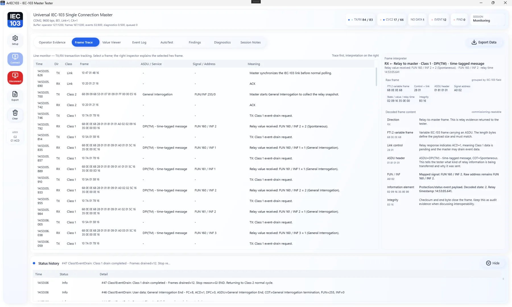
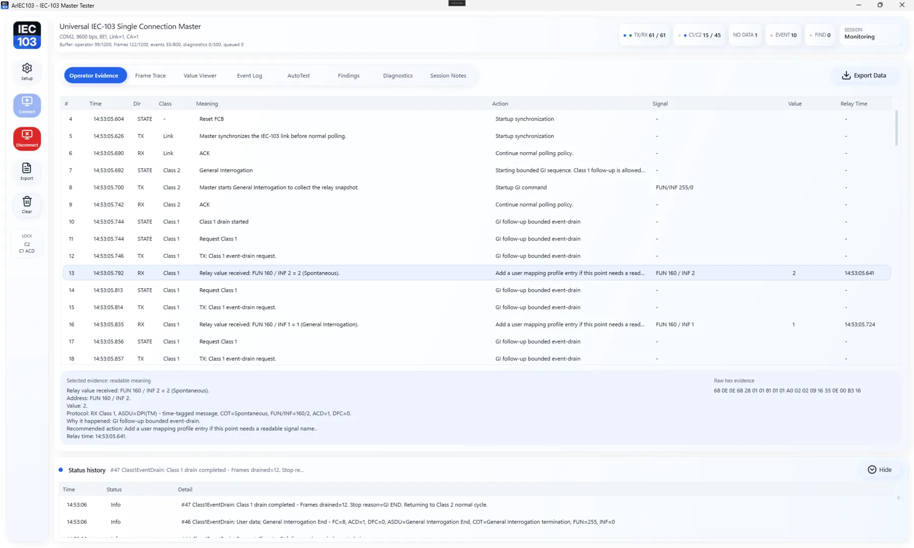
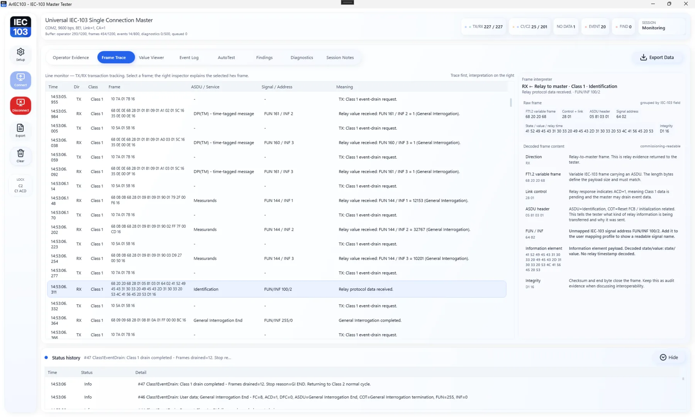
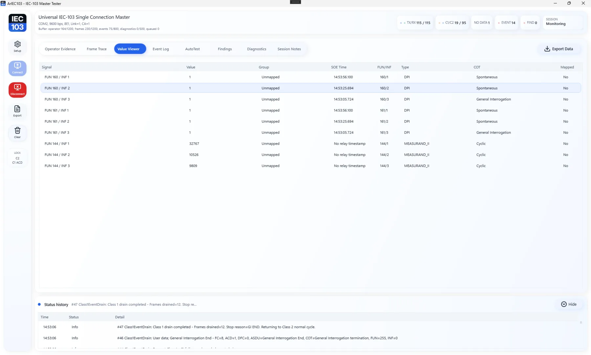
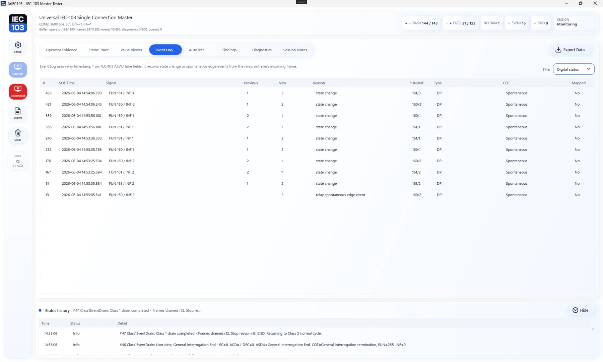

# ArIEC103 — Free IEC 60870-5-103 Master Tester & Analyzer for Protection Relays

[](https://github.com/masarray/ARIEC103/actions/workflows/ci.yml)
[](https://github.com/masarray/ARIEC103/actions/workflows/pages.yml)
[](https://github.com/masarray/ARIEC103/actions/workflows/release-package.yml)
[](https://github.com/masarray/ARIEC103/releases)
[](LICENSE)
[](#download-and-run)

**ArIEC103** is a **free and open-source** Windows desktop IEC 60870-5-103 / IEC-103 active master tester and analyzer for protection relay communication checks, FAT/SAT evidence, commissioning support, and troubleshooting review.

It connects to one IEC-103 slave relay, runs a controlled master session, decodes relay responses, keeps raw TX/RX frame evidence available, and presents the result as readable engineering output for protection, SCADA, panel FAT, site acceptance, and substation automation teams.

No license key. No subscription. No account required. Released under the **Apache-2.0** license.

<p align="center">
  <a href="https://masarray.github.io/ARIEC103/">
    
  </a>
</p>

## Why try ArIEC103?

ArIEC103 is designed for engineers who need to answer practical IEC-103 questions quickly:

- Is the relay answering on the selected COM port, baudrate, parity, and link address?
- Does General Interrogation start and finish cleanly?
- Are Class 1 events requested only when the relay indicates pending event data?
- What value/status did the relay send, and what was the relay timestamp?
- Can the test evidence be exported for FAT/SAT notes, troubleshooting review, or handover?

The tool does not hide the protocol behind a black box. It shows readable evidence first, while keeping raw FUN/INF/Type/COT/DPI/frame details available when deeper investigation is needed.

## Download and run

Get the latest Windows portable package from GitHub Releases:

[Download latest release](https://github.com/masarray/ARIEC103/releases/latest)

Typical release assets:

```text
ArIEC103-vX.Y.Z-win-x64-portable.zip
SHA256SUMS.txt
```

First run:

1. Extract the portable ZIP to a local folder.
2. Run `Start-ArIEC103.bat`.
3. Open **Setup**.
4. Select COM port, baudrate, link address, common address, timeout, GI option, and optional mapping profile.
5. Click **Start**.
6. Review **Operator Evidence**, **Value Viewer**, **Relay Event Log**, **Frame Trace**, and **Diagnostics**.
7. Export evidence after the test session.

## Screenshots

| Operator evidence | Setup overlay |
|---|---|
|  |  |

| Value and event review | Protocol visibility |
|---|---|
|  |  |

## Common use cases

- IEC 60870-5-103 relay communication check during panel FAT or bench testing.
- IEC-103 master polling verification for Class 1 event data and Class 2 background data.
- Protection relay event log review with relay timestamp basis visible.
- SCADA protocol troubleshooting when a relay does not respond as expected.
- User-owned signal mapping review using project JSON profiles.
- Evidence export for FAT/SAT notes, troubleshooting records, or engineering handover.

## What you get in the release package

- Windows desktop IEC-103 active master tester.
- CLI tools for active master runs, offline trace analysis, and simulator checks.
- Sample mapping profile.
- Sanitized IEC-103 test vectors for parser/decoder smoke tests.
- Quick Start and Troubleshooting guides.
- Markdown / JSON evidence output.
- License, notices, and checksum file.

## Windows desktop tester

- COM port setup for IEC-103 serial communication.
- Active master session against one relay/IED slave.
- Setup overlay for baudrate, link address, common address, timeout, GI, and polling behavior.
- Operator Evidence grid for readable session activity.
- Line Monitor / Frame Trace view for raw TX/RX frame inspection.
- Value Viewer snapshot for latest decoded relay points.
- Relay Event Log for relay-timestamped state changes and events.
- AutoTest-style assessment checklist.
- Diagnostics tab for recoverable runtime issues.
- Markdown evidence export.

## User-owned signal mapping

ArIEC103 decodes IEC-103 protocol fields such as Type, COT, FUN, INF, DPI/value, timestamp, checksum, and raw frame bytes.

Readable project signal names come from your own JSON mapping profile. This avoids guessed vendor naming and keeps FAT/SAT evidence aligned with the approved project signal list.

Example mapping entry:

```json
{
  "schema": "ariec103-mapping-profile-v1",
  "profileName": "Project A Feeder 01",
  "deviceName": "Relay Bay 01",
  "linkAddress": 1,
  "commonAddress": 1,
  "signals": [
    {
      "id": "bay01.breaker.position",
      "fun": 192,
      "inf": 36,
      "type": "DPI",
      "name": "Breaker Position",
      "group": "Switchgear",
      "stateMap": {
        "1": "Open",
        "2": "Closed"
      }
    }
  ]
}
```

If mapping is loaded, the app can display:

```text
Breaker Position | Closed | FUN 192 / INF 36 | relay timestamp
```

If mapping is not loaded, the app keeps raw protocol evidence visible:

```text
FUN 192 / INF 36 | DPI=2 | relay timestamp
```

## Master polling behavior

ArIEC103 uses a conservative master policy suitable for relay testing:

```text
Startup:
  Open transport
  Optional startup delay
  Optional reset remote link
  Reset FCB
  Optional clock sync
  Optional General Interrogation
  Bounded GI follow-up

Normal runtime:
  Poll Class 2 at the configured interval

If ACD=1:
  Drain Class 1 until NO DATA / GI END / ACD clear / DFC busy / max drain / timeout

If DFC=1:
  Back off and record busy evidence

If timeout or invalid response:
  Keep FCB state stable, record diagnostic evidence, and recover according to the configured timeout policy
```

Class 1 is treated as pending high-priority/event data, not as a blind continuous polling loop.

## Field validation kit

ArIEC103 includes a lightweight validation kit so releases are easier to evaluate and regressions are easier to catch:

- dependency-free protocol smoke tests;
- sanitized FT1.2 / ASDU test vectors in `samples/test-vectors/`;
- validation matrix template in `docs/VALIDATION_MATRIX.md`;
- troubleshooting guide for no response, checksum errors, malformed frames, GI issues, and mapping gaps.

Run the protocol checks:

```bash
dotnet run --project tests/ArIEC103.Protocol.Tests
```

## Evidence privacy

By default, exported evidence uses the mapping profile file name instead of exposing the full local workstation path.

Before sharing reports outside a project team, review project names, relay addresses, serial settings, mapping labels, comments, and raw frame evidence.

## Useful documents

- [Quick Start](docs/QUICK_START.md)
- [Troubleshooting Guide](docs/TROUBLESHOOTING.md)
- [Validation Matrix](docs/VALIDATION_MATRIX.md)
- [Planned Improvements](docs/ROADMAP.md)
- [Test Vectors](samples/test-vectors/README.md)

## Build from source

Requirements:

- .NET 8 SDK
- Windows for the WPF desktop app
- Visual Studio 2022/2026 or command line `dotnet`

Build:

```bash
dotnet restore
dotnet build
```

Run WPF desktop:

```bash
dotnet run --project src/ArIEC103.Desktop
```

Run a simulated master session without hardware:

```bash
dotnet run --project src/ArIEC103.Cli -- master --simulate --duration 10 --mapping samples/mapping-profiles/example-user-mapping.profile.json --report out/demo-master-evidence.md --json out/demo-master-evidence.json
```

Run active master against a real relay:

```bash
dotnet run --project src/ArIEC103.Cli -- master --port COM1 --baud 9600 --link 1 --ca 1 --duration 30 --mapping samples/mapping-profiles/example-user-mapping.profile.json --report out/master-evidence.md --json out/master-evidence.json
```

Run offline analyzer:

```bash
dotnet run --project src/ArIEC103.Cli -- analyze samples/sample_iec103_trace.log --report out/report.md --json out/report.json
```

Run deterministic slave simulator:

```bash
dotnet run --project src/ArIEC103.Cli -- slave --port COM2 --baud 9600 --link 1 --ca 1 --duration 300
```

Run protocol smoke tests:

```bash
dotnet run --project tests/ArIEC103.Protocol.Tests
```

## Product boundary

ArIEC103 is intentionally focused:

- one IEC-103 connection first;
- active master tester first;
- offline trace analyzer as a supporting mode;
- user mapping profiles instead of guessed vendor profiles;
- raw FUN/INF/Type/COT/DPI/frame evidence always preserved;
- no built-in vendor-specific signal database.

It is not a vendor-specific tester, not a multi-protocol SCADA gateway, and not a replacement for formal site acceptance procedures.

## Release maturity

Current releases are suitable for test-bench evaluation, communication troubleshooting, protocol evidence review, and public feedback.

For production or contractual FAT/SAT use, validate the package with the target relay, project communication settings, and approved project signal mapping before relying on exported evidence.

## License

ArIEC103 is free and open source under the **Apache License, Version 2.0**. See `LICENSE`.
